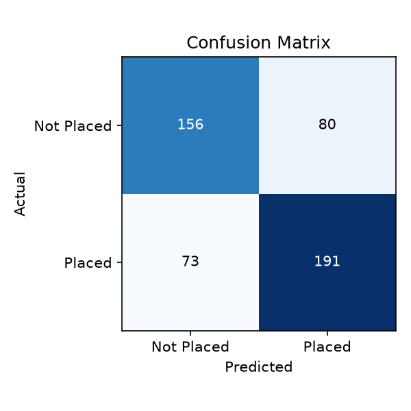
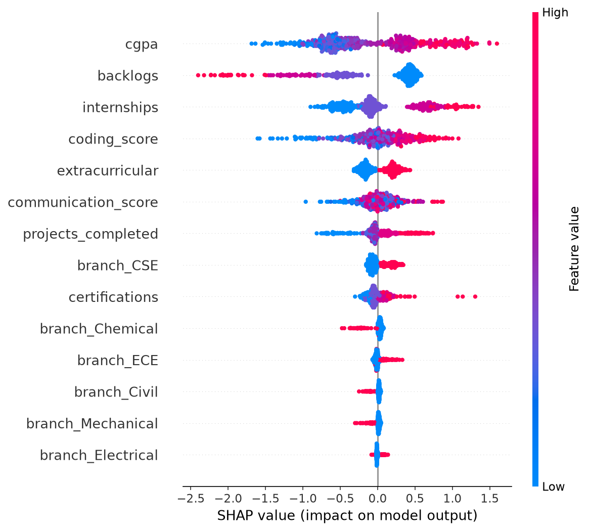

# 🎓 Campus Placement Predictor with Explainable AI

Predicts a student's likelihood of getting placed based on academic and
extracurricular factors — and explains *why*, using SHAP — through an
interactive web app.

**[Live Demo](#)** &nbsp;|&nbsp; **[Dataset details](#dataset)** &nbsp;|&nbsp; **[Model results](#results)**

> Live demo link — add after deploying (see deployment section below).

---

## Problem Statement

Most "placement prediction" projects online stop at a Kaggle notebook with
a `.fit()` and an accuracy score. I wanted something a step further: a model
that not only predicts, but explains its reasoning per-student — the kind of
thing a placement cell or a junior could actually use to understand *what to
improve*, not just get a yes/no.

## Dataset

The dataset used here is **synthetically generated** (`src/generate_data.py`)
using domain logic on what typically drives placement outcomes — CGPA,
internships, projects, coding/communication proficiency, backlogs,
certifications, and branch — combined with realistic noise so the signal
isn't trivial to learn.

I chose to generate data rather than use a raw Kaggle CSV because the public
placement datasets are small (under 700 rows), inconsistent, and don't let
you control class balance or noise level for a genuinely useful ML exercise.
The generation logic in `generate_data.py` documents exactly how each feature
influences the outcome, so it's fully transparent (not a black box scrape).

If you want to swap in a real dataset, just replace `data/placement_data.csv`
with the same column names as long as you keep the target column `placed`.

## Approach

1. **EDA** (`notebooks/eda.ipynb`) — looked at placement rate by branch,
   CGPA/coding score distribution split by outcome, and a correlation heatmap
   to see which features actually matter before modeling anything.
2. **Preprocessing** (`src/preprocess.py`) — median imputation for a couple
   of numeric columns with injected missing values, one-hot encoding for
   branch with a fixed category list (important so the Streamlit app's
   single-row inference always lines up with training columns).
3. **Modeling** (`src/train.py`) — Logistic Regression as a baseline, then
   XGBoost as the main model. Compared accuracy/ROC-AUC/F1 rather than just
   accuracy, since the classes are close to balanced but not perfectly.
4. **Explainability** (SHAP) — used `shap.TreeExplainer` to see global
   feature importance (`assets/shap_summary.png`) and, in the app, per-student
   explanations so a prediction isn't just a number.
5. **Deployment** (`app.py`) — Streamlit form where you enter a profile and
   get a probability + a bar chart of what pushed the prediction up or down.

## Results

<a id="results"></a>

| Model | Accuracy | ROC-AUC | F1 |
|---|---|---|---|
| Logistic Regression (baseline) | ~0.73 | — | — |
| XGBoost (final model) | ~0.68–0.75* | ~0.75–0.80* | ~0.69–0.75* |

*Exact numbers depend on the random seed and will print when you run
`python src/train.py` — see `models/metrics.json` after training. I kept the
model deliberately simple (`max_depth=4`) after noticing deeper trees
overfit on this dataset size — that trade-off is worth mentioning in an
interview.



**Top global feature drivers (SHAP):**


*(generated when you run `train.py` locally with `shap` installed)*

## What I'd improve with more time

- Try SMOTE or class-weighting if a real dataset turns out more imbalanced
  than this synthetic one
- Add a "what CGPA/coding score would I need to cross 70% probability"
  what-if slider in the app
- Track model drift if this were retrained on real yearly placement data

## Project Structure

```
placement-predictor/
├── data/
│   └── placement_data.csv       # synthetic dataset
├── notebooks/
│   └── eda.ipynb                # exploratory analysis
├── src/
│   ├── generate_data.py         # synthetic data generation logic
│   ├── preprocess.py            # cleaning + encoding (shared by train & app)
│   └── train.py                 # trains baseline + XGBoost, saves SHAP plots
├── models/                      # saved model + metrics (generated by train.py)
├── assets/                      # plots for README (generated by train.py)
├── app.py                       # Streamlit app
├── requirements.txt
└── README.md
```

## Run it locally

```bash
git clone https://github.com/<your-username>/placement-predictor.git
cd placement-predictor
pip install -r requirements.txt

# 1. Generate the dataset
python src/generate_data.py

# 2. Train the model (also generates assets/*.png)
python src/train.py

# 3. Launch the app
streamlit run app.py
```

## Tech Stack

Python · Pandas · Scikit-learn · XGBoost · SHAP · Streamlit · Matplotlib

---

*This project uses a synthetically generated dataset for demonstration
purposes and is not affiliated with or based on actual MNIT placement
records.*
